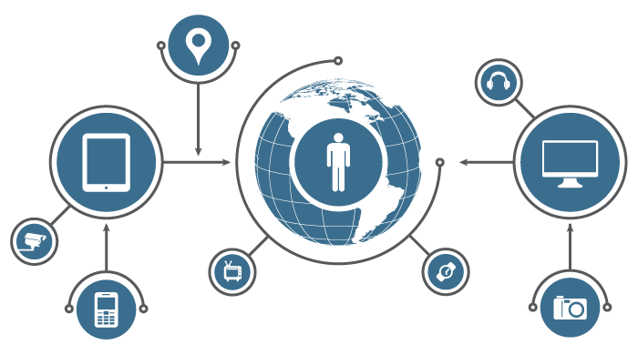

# Introduction

There was a time when making a fresh coffee was consisted of multiple tasks. One would go to market to buy fresh aromatic coffee beans, grind them and store the coffee powder in a jar. Afterwards, the next morning one would go to kitchen, brew a coffee and in the meantime get a newspaper from the front door. As you can presume it was a long process until one would sip a tasteful coffee. Fast forwarding to 2020, we have a smart coffee machine which interacts with the arm band to find out one's sleeping schedule and brew a coffee by the time one reaches to the kitchen. Additionally, it can order your favorite coffee beans from the preferred seller and automatically make payment using credit card details saved on the machine.

We are surrounded by many such smart devices like a coffee machine. These smart devices are equipped with wireless communication protocols, such WiFi, Bluetooth, NFC, LoRaWAN etc. Therefore, they can talk to each other. Moreover, they are connected to internet. These smart connected devices are referred as Internet for Things (IoT) devices. The innovations in the IoT technologies have given rise to machine to machine communications. The IoT devices are ubiquitous whether it be our home, city, work place or hospital. Interestingly, we live in the times where the smart devices talk back and interact with us more than humans. By 2030, the number of IoT devices and IoT market size are projected to reach 125 billion and 1.3 trillion USD respectively.

On one hand, the IoT devices simplify the processes and consequently make our lives convenient on the other hand they pose greater security threats. For an instance, if one hacks the benign looking smart coffee machine it could reveal your WLAN credentials, credit card details, sleeping pattern and much more personal data. On top of that, it can be used as a bot to raise cyber security attacks on other digital resources. For an example, Mirai-2016 turned network connected devices to a botnet to launch DDoS attacks. It infected over 6 million devices. Such type of attacks have been increasing multifold with the exponential growth in the number of IoT devices. There are multiple reasons, such as weak default passwords, small encryption keys, no updates etc.

One of the major concerns is that the IoT devices do not have over the air firmware update mechanism. It is paramount to have a very well defined, secured process to patch a vulnerable firmware. The IoT devices are manufactured and managed by set and forget policy. Which means the IoT devices are configured at the start and then left alone for the life to fight against the security attacks. Nowadays, the technologies change so fast that it is of greatest importance to assess the threat landscape of IoT devices continuously and update the firmware regularly with latest security patches.

In the last couple of years, there has been developments in the area of update platforms for IoT devices. There are some solutions, such as Eclipse hawkBit, Mbed, and Mender. They address the existing problem but there solution is limited to particular micro-controller architecture, software stacks and industries. They are fundamentally designed and developed as centralized solutions which are prone to single point failure and do not scale very well. The following sections describe how Asvin platform differentiates itself from these solutions.

## Asvin Platform

Asvin Platform is an enterprise grade cloud platform to distribute security patches and generate a chain of trust using distributed ledger technology (DLT) for IoT devices. The Asvin Platform is powered by some key differentiating technologies those disjoint it from other OTA solutions.

One of the distinct feature is that Asvin Platform is powered by **distributed** and **decentralized** technologies. Asvin Platform utilizes Interplanetary Filesystem (IPFS) to store and manage firmware files of IoT devices. All firmware files and patches are distributed among multiple IPFS nodes. The critical metadata information pertaining to devices is saved in a distributed ledger (DL). Moreover, each event taking place on the asvin platform is also recoded in an immutable ledger. These technologies increase the fault tolerance of the platform and make it more available and resilient.

The asvin platform has a highly **customizable** and **modular** architecture. The asvin platform has been designed and developed to support the diverse industries in the IoT sector. It offers pluggable modules and services to customize and optimize according the use case.

The asvin platform is extremely **scalable**. It is the most desirable feature of any IoT solution. It is one thing to have a working prototype of IoT product and another to administer and update millions of smart devices. The asvin platform does it efficiently.

The asvin platform is a **universal** solution. Unlike the other FUOTA solutions it is not restrictive in nature for any hardware and software stack. It brings out innovation and versatility for any IoT application built with Atmel AVR to ARM Cortex M7, ranging from agricultural to banking sector.
